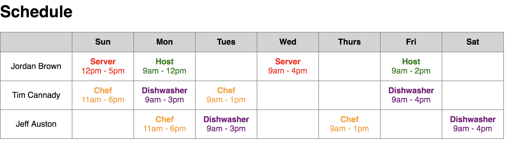

### Intro

Congratulations! You're the first software engineer at Homebase. Your efforts could revolutionize the tedious, error-prone process of pen-and-paper scheduling that plagues the majority of local businesses. Your work may even create the world's best, cheapest, and most beloved software for scheduling, time tracking, and team management!

### Step 1: Build a Schedule

The first step on our path to radically improving scheduling for our customers is building a digital schedule. You receive the following ticket from John Waldmann, your product manager:

#### Ticket

*Online Schedule for Managers & Employees*

As a manager using homebase, I want to see an online schedule for all my employees for the current week so that I and my employees have a globally accessible single source of truth for this week's schedule. 

Acceptance Criteria:
- Use the JSON payload (`/src/data1.js`) to create a schedule that looks like this:

#### Dev Notes
- Pragmatism is key - remember, you're the founding engineer at a scrappy startup
- While you may use third party libraries, they are not necessary for this ticket
- Use any tools you'd normally use in development (looking at you, internet)
